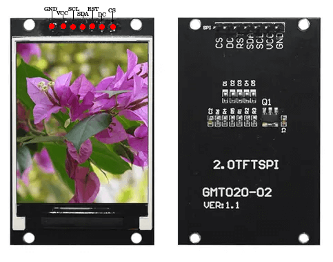

# Requirements:
- ESP32 Wroom 32U
- TFT SPI screen 2",240×320px, (GMT020-02)   (driver ST7789V)

# ESP-32 DEV board usefull tips
# Install the esp32 boards

## Install display driver 
> Tools -> Manage libraries -> tft_espi by bodmer
> Change the tft_espi header files
> (path depends on library loc) /Arduino/libraries/TFT_eSPI/User_setup.h


#Get usb debug/serial working
- ```sudo usermod -a -G dialout $USER``` --Current user access rights, Only once
- Change upload speed to 460800 (IDE -> Tools -> Upload speed), the default 921600 too high
- When IDE says connecting press Boot on esp32 to allow upload.
- Sometimes data upload will fail due to insufficient power... Try to disconnect power for display and retry upload.


[Helpful](https://www.youtube.com/watch?v=rq5yPJbX_uk)
```
#define TFT_MISO -1  //19
#define TFT_MOSI 23
#define TFT_SCLK 18
#define TFT_CS   15  // Chip select control pin
#define TFT_DC    2  // Data Command control pin
#define TFT_RST   4  // Reset pin (could connect to RST pin)
```
- GND : Power Ground
- VCC/3.3 : Power input
- CS : Chipselect
- DC : Data Command control pin
- RST : Reset pin (could connect to RST pin)
- SCK/SCLK/SCL (SD-Clock): SPI Clock
- MOSI (SD-DI, DI) : SPI Master out Slave in
- MISO (SD-DO, DO) : SPI Master in Slave out

 

